# Cafe-Employee-Management-System

Web application for managing café employees, built with React for the front-end and .NET for the back-end.

## Overview

The Cafe-Employee-Management-System is designed to streamline the management of cafes and their employees. The application provides a modern interface for managing employee records, cafe details, and more.

## Technologies Used

### Front-End

- **React.js**: A JavaScript library for building user interfaces.
- **Tanstack Query**: A powerful data-fetching and state-management tool for React.
- **Tanstack Router**: A routing library that provides flexible routing solutions.
- **Ag-Grid**: A feature-rich data grid providing high-performance table rendering.
- **Material-UI**: A popular React UI framework for creating responsive, modern user interfaces.

### Back-End

- **.NET 6.0**: A cross-platform framework for building web applications and APIs.
- **Entity Framework Core 6.0.33**: An object-relational mapper (ORM) for .NET that simplifies database interactions.
- **Swashbuckle.AspNetCore.Swagger 6.7.3**: Tools for generating Swagger API documentation.
- **Pomelo.EntityFrameworkCore.MySql**: A MySQL provider for Entity Framework Core, allowing it to interact with MySQL databases.
- **MySQL**: An open-source relational database management system.
- **Workbench**: A visual tool for designing, developing, and managing MySQL databases.

## Installation

### Install Front-End Dependencies and Start the Application

npm install
npm start

## Configure the Database Connection

Update the connection string in the `appsettings.json`:

Server=localhost;Database=CafeEmployeeDB;User=root;Password=password;

## DB Migration

Go to To -> NuGet Package Manager -> Package Manager Console

run -> Update-Database

## Screenshots

**Front-End

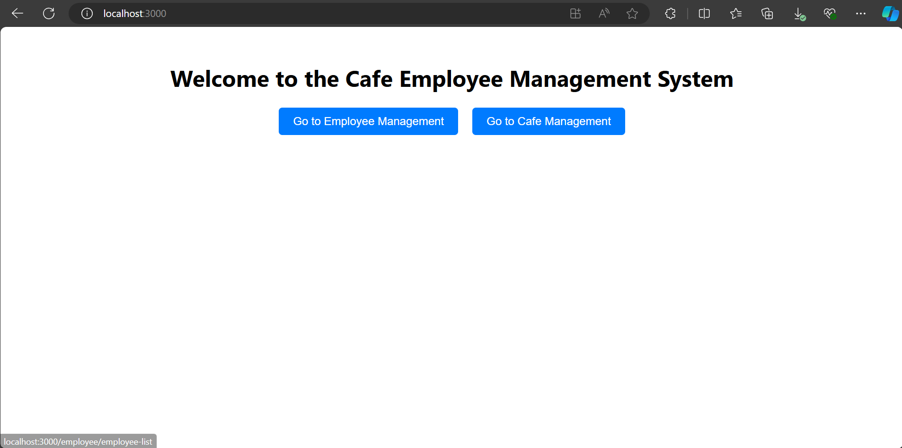

**Employee

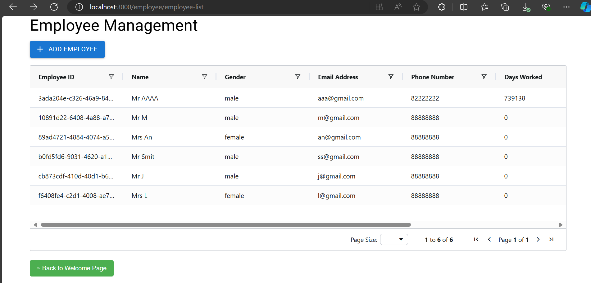

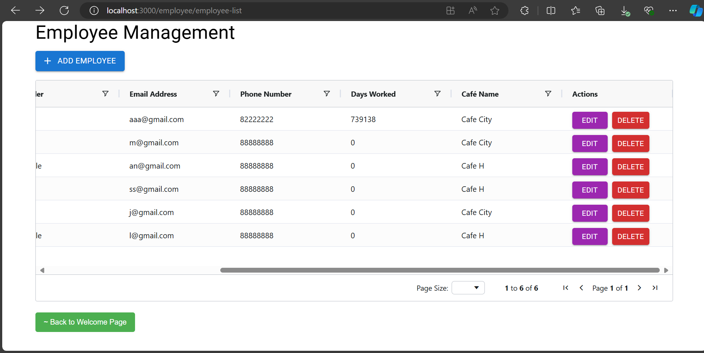

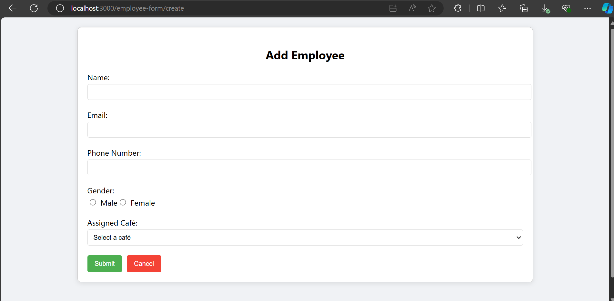

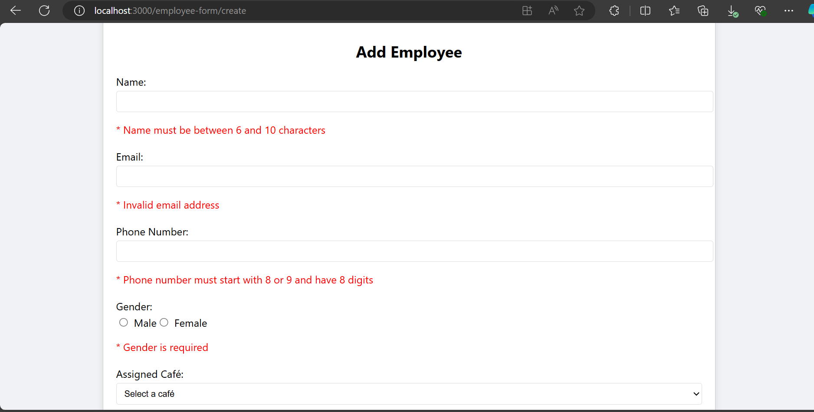

** Cafe

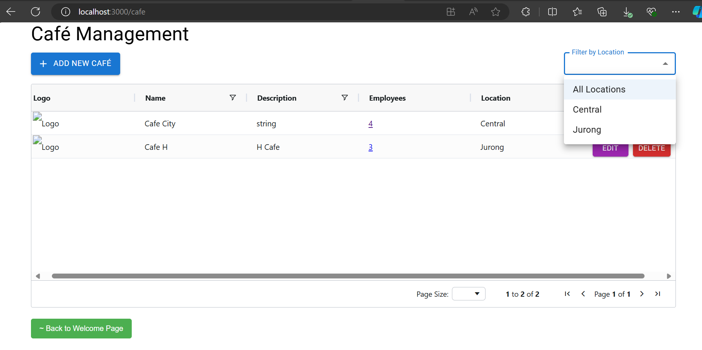

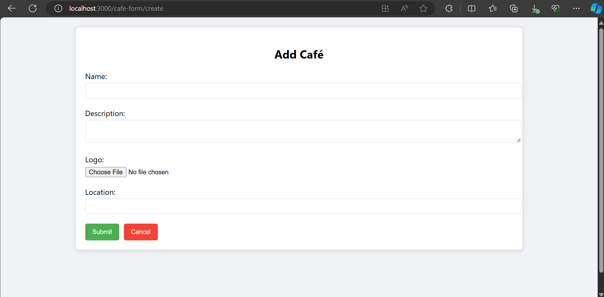 

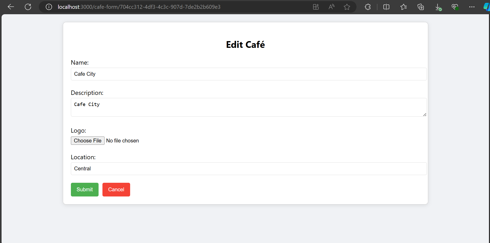 

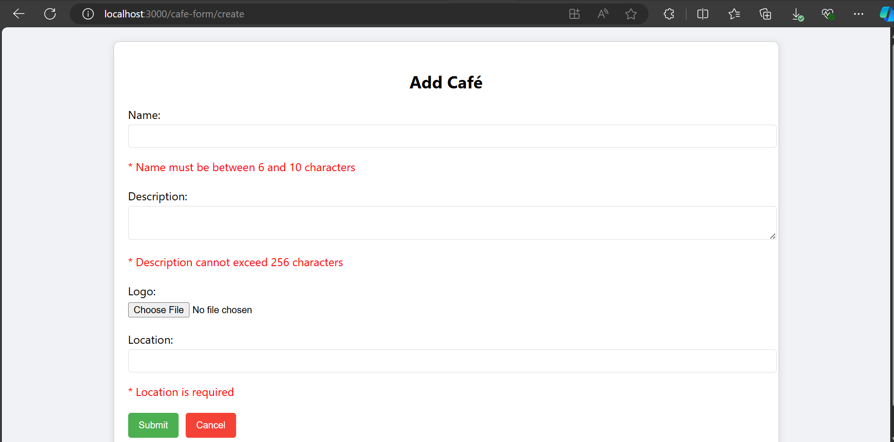 

##Back-End

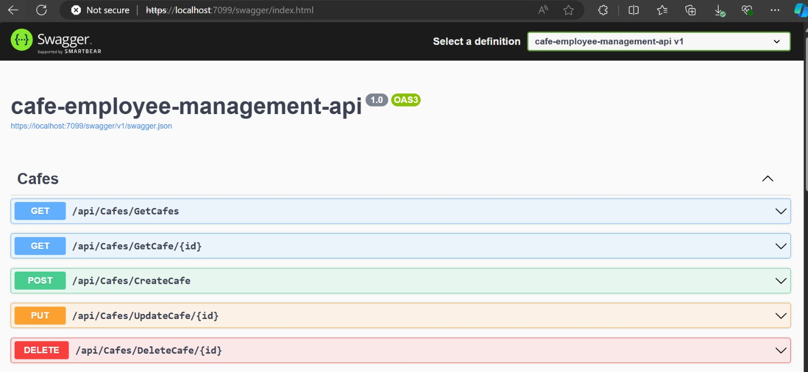 

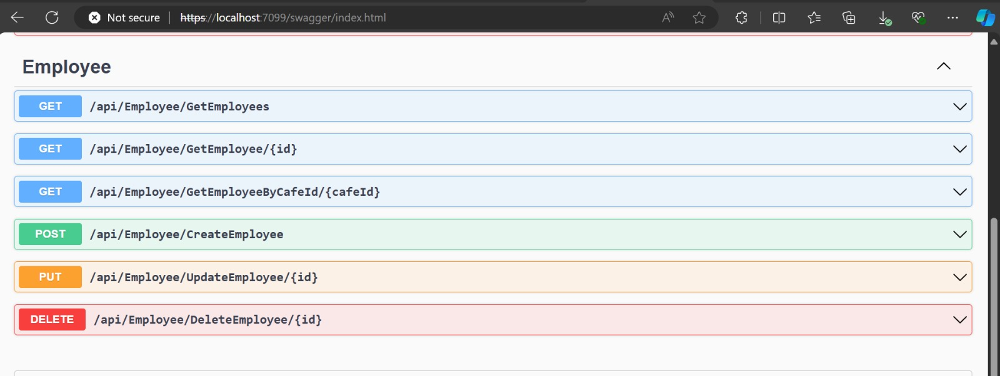 

